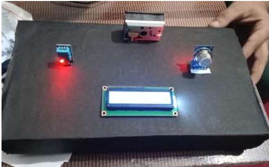

# Real-Time Air Quality Monitoring System

A real-time Air Quality Monitoring System using an Arduino, a dust sensor (GP2Y1010AU0F), a gas sensor (MQ2), and a temperature/humidity sensor (DHT11). This project was developed as part of the ECE curriculum at J.C. Bose University, YMCA.

## Key Features
- **Real-Time Monitoring:** Measures and displays key environmental pollutants and the final Air Quality Index (AQI) every 2 seconds.
- **Multi-Sensor Integration:** Combines data from three different sensors (Particulate Matter, Gas, Temperature/Humidity) for a comprehensive environmental overview.
- **User-Friendly Display:** A 16x2 LCD screen shows the final AQI value, a clear status level (e.g., "Good", "Hazardous"), temperature, and humidity.
- **Standalone & Portable:** Designed as a self-contained unit that can be deployed anywhere without needing an internet connection.

## Hardware Components
- **Microcontroller:** Arduino Uno (or compatible)
- **Sensors:**
    - **Particulate Matter:** Sharp GP2Y1010AU0F
    - **Gas:** MQ2 Gas Sensor
    - **Temperature & Humidity:** DHT11
- **Display:** 16x2 I2C LCD Module
- **Other:** Jumper Wires, Breadboard/Vero Board, Project Enclosure

## Software & Tools
- **IDE:** Arduino IDE
- **Programming Language:** C++
- **Libraries:** `Wire.h`, `LiquidCrystal_I2C.h`, `DHT.h`

## How It Works
1.  The `DHT11` sensor reads the ambient temperature and humidity.
2.  The `MQ2` sensor detects the concentration of harmful gases and provides an analog reading.
3.  The `GP2Y1010AU0F` dust sensor's internal IR LED is pulsed, and the scattered light is measured to determine the concentration of particulate matter (PM2.5).
4.  The Arduino reads the analog values from the gas and dust sensors and converts them into concentration levels.
5.  An individual AQI is calculated for both gas and dust. The final, displayed AQI is the higher (worse) of the two values.
6.  All relevant data (Final AQI, Status, Temp, Humidity) is sent to the 16x2 LCD for display.

## Project Report
For full details on the project's design, principles, and implementation, you can view the complete project report here:
[**View Full Project Report PDF**](./project%20report%5B1%5D.pdf)

---
*This project demonstrates practical skills in embedded systems, sensor integration, C++ programming, and hardware prototyping.*
